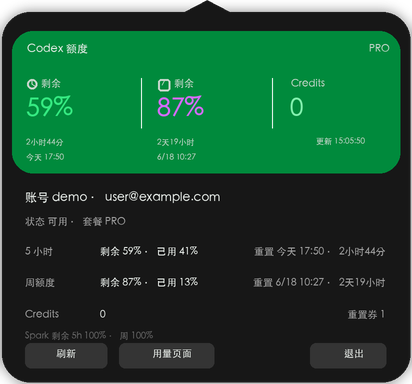

# Codex Auth Tools

[Chinese version](#中文说明)

A small local toolkit for Codex account switching and quota visibility.

This repository contains two tools:

| Tool | Command or app | Purpose |
| --- | --- | --- |
| Codex Balance | `CodexBalance` | macOS menu bar widget that shows the current Codex account quota. |
| Codex Auth | `ca`, `codex-ac` | Local Codex account manager for switching and inspecting saved Codex auth snapshots. |

The tools read local Codex login state from `~/.codex`. They do **not** include any account, token, cookie, or personal cache data.

## Screenshots

Status bar:


Popover sample:



The popover screenshot is generated with sample data and contains no real account information.

## Repository layout

```text
codex-auth-tools/
  assets/                 # README images with sample data only
  codex-balance/          # Swift/AppKit menu bar widget
  codex-auth/             # ca / codex-ac account manager
  docs/                   # detailed docs
  scripts/                # install helpers
```

## Codex Balance

Codex Balance is a lightweight macOS status bar app. It reads the active Codex OAuth login from `~/.codex/auth.json`, calls the Codex usage endpoint, and displays:

- 5-hour quota remaining
- weekly quota remaining
- account alias and email
- plan and availability
- Credits
- Spark remaining quota
- reset countdown and reset time

It refreshes every 30 seconds. Opening the popover or clicking refresh updates immediately. If you switch accounts with `ca s <alias>`, the widget follows the new `~/.codex/auth.json` on the next refresh.

When the active account is an API relay profile, Codex Balance reads the relay usage endpoint and displays:

- remaining balance or quota
- today's cost and total cost
- today's token usage and total token usage
- request count and input/output token split when available

### Build and install

```bash
./scripts/install-codex-balance.sh
```

The default install path is:

```text
~/Library/Application Support/CodexBalance/CodexBalance
```

The default LaunchAgent label is:

```text
com.codexlocaltools.codex-balance
```

To use a custom LaunchAgent label:

```bash
CODEX_BALANCE_LAUNCHD_LABEL=com.example.codex-balance ./scripts/install-codex-balance.sh
```

## Codex Auth (`ca`)

Codex Auth is a local account manager for Codex auth snapshots. It can:

- import the current `~/.codex/auth.json`
- switch active accounts by replacing `~/.codex/auth.json`
- list saved accounts and cached quota usage
- add API-compatible providers
- run Codex with an isolated account home

### Install

```bash
./scripts/install-codex-auth.sh
```

Commands:

```bash
ca --help
ca ll
ca current
ca s <alias>
```

`ca` stores account snapshots under `~/.codex-ac` by default. Auth snapshots are private local files and must never be committed.

API and relay accounts are supported too:

```bash
printf 'sk-...' | ca add-api relay --base-url https://relay.example.com/v1 --model gpt-5-codex
ca s relay
ca s <chatgpt-alias> --skip-expiry-check
```

API keys are kept in Keychain or `~/.codex-ac/secrets`, not in `config.toml`. For sub2api-compatible relays, Codex Balance reads `GET <base-url>/usage`; for example, `https://relay.example.com/v1` maps to `https://relay.example.com/v1/usage`.

If a relay uses a different usage endpoint:

```bash
printf 'sk-...' | ca add-api relay --base-url https://relay.example.com/v1 --usage-url https://relay.example.com/v1/usage --model gpt-5-codex
```

## Usage endpoint

For ChatGPT subscription accounts, the tools use the current local Codex login to read usage data from:

```text
https://chatgpt.com/backend-api/wham/usage
```

The endpoint currently returns quota percentages, reset times, plan type, Credits, and additional rate limits such as Spark. It does not provide a reliable membership expiration date, so the tools do not display one.

For API or relay accounts, Codex Balance does not call the ChatGPT quota endpoint. It calls the relay usage endpoint with the saved API key when available. sub2api-compatible relays expose this as:

```text
GET /v1/usage
```

The response can include balance, quota, today's cost, total cost, today's tokens, total tokens, request count, and input/output token split.

## Proxy

`codex-auth` can optionally use a proxy for usage refresh:

```bash
CODEX_AC_USAGE_PROXY=http://localhost:8080 ca ll
```

If no proxy is set, it tries the direct request path.

## Security notes

- Do not commit `~/.codex/auth.json`, `~/.codex/accounts/*.auth.json`, or `~/.codex-ac`.
- Do not publish `last-status.json` if it contains personal account identifiers.
- The repository `.gitignore` blocks common local auth and state files.
- The tools operate only on local files and the current Codex usage endpoint.

## License

MIT.

---

# 中文说明

[英文说明](#codex-auth-tools)

一个用于本机 Codex 多账号切换和额度查看的小工具仓库。

本仓库包含两个工具：

| 工具 | 命令或程序 | 用途 |
| --- | --- | --- |
| Codex Balance | `CodexBalance` | macOS 顶部状态栏额度控件，展示当前 Codex 账号额度。 |
| Codex Auth | `ca`, `codex-ac` | 本机 Codex 账号管理工具，用于保存、切换和查看本地 Codex 登录快照。 |

这些工具会读取本机 `~/.codex` 下的 Codex 登录状态。仓库本身不包含任何账号、token、cookie 或个人缓存数据。

## 截图

状态栏：


面板示例：


面板截图使用示例数据重新生成，不包含真实账号信息。

## 仓库结构

```text
codex-auth-tools/
  assets/                 # README 示例图，不包含真实账号信息
  codex-balance/          # Swift/AppKit 状态栏控件
  codex-auth/             # ca / codex-ac 账号管理工具
  docs/                   # 详细文档
  scripts/                # 安装脚本
```

## Codex Balance

Codex Balance 是一个轻量的 macOS 状态栏应用。它读取当前 Codex OAuth 登录文件 `~/.codex/auth.json`，调用 Codex 用量接口，并展示：

- 5 小时额度剩余
- 周额度剩余
- 账号别名和邮箱
- 套餐和可用状态
- Credits
- Spark 剩余额度
- 距离重置还剩多久，以及具体重置时间点

它每 30 秒自动刷新一次。打开面板或点击刷新会立即更新。如果使用 `ca s <alias>` 切换账号，控件会在下一次刷新时跟随新的 `~/.codex/auth.json`。

当前账号是 API 中转配置时，Codex Balance 会读取中转用量接口，并展示：

- 余额或剩余额度
- 今日费用和累计费用
- 今日 token 用量和累计 token 用量
- 可用时展示请求数、输入 token 和输出 token

### 构建和安装

```bash
./scripts/install-codex-balance.sh
```

默认安装路径：

```text
~/Library/Application Support/CodexBalance/CodexBalance
```

默认 LaunchAgent 名称：

```text
com.codexlocaltools.codex-balance
```

如需自定义 LaunchAgent 名称：

```bash
CODEX_BALANCE_LAUNCHD_LABEL=com.example.codex-balance ./scripts/install-codex-balance.sh
```

## Codex Auth (`ca`)

Codex Auth 是一个本机 Codex 账号管理工具。它可以：

- 导入当前 `~/.codex/auth.json`
- 通过替换 `~/.codex/auth.json` 切换当前账号
- 列出已保存账号和缓存额度
- 添加兼容 OpenAI API 的服务商账号
- 用隔离账号目录运行 Codex

### 安装

```bash
./scripts/install-codex-auth.sh
```

常用命令：

```bash
ca --help
ca ll
ca current
ca s <alias>
```

`ca` 默认把账号快照保存在 `~/.codex-ac`。这些登录快照是本机私有文件，绝不能提交到 Git 仓库。

也支持 API key 和中转域名账号：

```bash
printf 'sk-...' | ca add-api relay --base-url https://relay.example.com/v1 --model gpt-5-codex
ca s relay
ca s <chatgpt-alias> --skip-expiry-check
```

API key 会保存在 Keychain 或 `~/.codex-ac/secrets`，不会写进 `config.toml`。对于兼容 sub2api 的中转，Codex Balance 会读取 `GET <base-url>/usage`；例如 `https://relay.example.com/v1` 会对应 `https://relay.example.com/v1/usage`。

如果中转使用不同的用量接口：

```bash
printf 'sk-...' | ca add-api relay --base-url https://relay.example.com/v1 --usage-url https://relay.example.com/v1/usage --model gpt-5-codex
```

## 用量接口

对于 ChatGPT 订阅账号，工具会使用当前本机 Codex 登录态读取用量：

```text
https://chatgpt.com/backend-api/wham/usage
```

这个接口目前会返回额度百分比、重置时间、套餐类型、Credits，以及 Spark 这类额外限制。它没有可靠的会员过期日字段，所以工具不会展示会员过期日。

对于 API 或中转账号，Codex Balance 不会调用 ChatGPT 订阅额度接口。它会在可用时使用保存的 API key 调用中转用量接口。兼容 sub2api 的中转接口是：

```text
GET /v1/usage
```

返回内容可包含余额、额度、今日费用、累计费用、今日 token、累计 token、请求数，以及输入和输出 token 拆分。

## 代理

`codex-auth` 刷新用量时可以选择走代理：

```bash
CODEX_AC_USAGE_PROXY=http://localhost:8080 ca ll
```

不设置代理时，会直接请求接口。

## 安全说明

- 不要提交 `~/.codex/auth.json`、`~/.codex/accounts/*.auth.json` 或 `~/.codex-ac`。
- 如果 `last-status.json` 里包含个人账号标识，不要发布它。
- 仓库的 `.gitignore` 已屏蔽常见本机登录文件和状态文件。
- 工具只操作本机文件，并访问当前 Codex 用量接口。

## 许可证

MIT。
