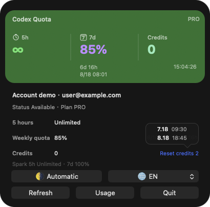
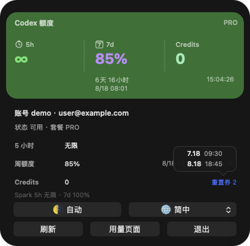

# Codex Auth Tools

[](https://github.com/D-acoo1/codex-auth-tools) [](https://github.com/D-acoo1/codex-auth-tools/forks) [](https://github.com/D-acoo1/codex-auth-tools/graphs/contributors) [](https://github.com/D-acoo1/codex-auth-tools/releases/latest) [](LICENSE)

[中文说明](#中文说明)

A local-first macOS toolkit for switching Codex accounts, keeping saved ChatGPT login snapshots usable, and seeing current subscription or relay usage without opening a browser.

> [!IMPORTANT]
> This is an independent community project, not an official OpenAI product. It reads and updates sensitive local Codex authentication state. Review the [security model](SECURITY.md) before installation.

## Why this project exists

Codex stores the active login locally, but users who work with multiple accounts or API-compatible relays otherwise have to switch files manually, inspect opaque quota responses, and discover expired saved logins only when they need them. Codex Auth Tools solves those problems with two small components:

| Component | Command or app | Problem solved |
| --- | --- | --- |
| **Codex Balance** | `CodexBalance` | Shows current 5-hour, weekly, Credits, Spark, reset, or relay usage in the macOS menu bar. |
| **Codex Auth** | `ca`, `codex-ac` | Saves, lists, renews, and switches local Codex login snapshots and API-compatible relay profiles. |

The project has no hosted account service and no project-operated analytics backend. Account snapshots, API keys, cached usage, and configuration are persisted on the user's Mac; credentials are transmitted only to the selected ChatGPT or relay service when an authenticated operation requires them.

## Public project snapshot

The badges above always link to live GitHub data. This dated snapshot makes the public project state explicit without pretending it will remain current forever:

| Metric | Snapshot on 2026-08-26 | Live source |
| --- | ---: | --- |
| Stars | 103 | [Repository API](https://api.github.com/repos/D-acoo1/codex-auth-tools) |
| Forks | 4 | [Forks](https://github.com/D-acoo1/codex-auth-tools/forks) |
| Contributors | 3 | [Contributors](https://github.com/D-acoo1/codex-auth-tools/graphs/contributors) |
| Latest release | `v2026.08.26` | [Releases](https://github.com/D-acoo1/codex-auth-tools/releases) |

## Who it is for

- macOS developers who switch between more than one Codex ChatGPT login;
- users of OpenAI-compatible API or relay profiles who want one local account switcher;
- maintainers and testers who need quick quota visibility and reproducible account-state checks;
- users who prefer transparent local files and scripts over a hosted credential manager.

It is **not** a team credential vault, a cloud account-sync service, or a replacement for Codex authentication. The source target is macOS 13 or later; the install and keepalive flows use macOS Keychain and LaunchAgents. As of 2026-08-26, the latest prebuilt GitHub release is Apple silicon (`arm64`) only. Intel Mac users must build from source because no Intel prebuilt package is currently published.

## Project classification

| Category | In this project? | Details |
| --- | --- | --- |
| AI Agent | No | The shipped runtime does not plan tasks, call a model, or act on natural-language instructions. |
| Plugin, Skill, or MCP server | No | Nothing is installed into Codex as a plugin, Skill, or MCP integration. |
| CLI | Yes | `ca` / `codex-ac` manages local accounts and cached usage. |
| Developer utility | Yes | `CodexBalance` and `ca` support local Codex workflows. |
| Automation | Yes | A LaunchAgent checks saved ChatGPT snapshots every 24 hours and renews only those close to expiry. |
| Local code execution | Limited and explicit | Install scripts run shell commands, `ca run` launches the installed Codex CLI, keepalive launches its `app-server`, and relay profiles use a configured key-helper command. Only trusted source, releases, Codex installations, profiles, and helper commands should be used. |
| Third-party contributions | Yes | The public repository accepts reviewed issues and pull requests under the [contribution guide](CONTRIBUTING.md). |

## Main features

### Codex Balance

- reads the active Codex login from `~/.codex/auth.json`;
- classifies quota windows by duration instead of API field order;
- shows a missing 5-hour limit as unlimited without copying the weekly value;
- displays 5-hour, weekly, Credits, Spark, reset time, plan, account, and availability data;
- displays balance, cost, token usage, and request totals for supported relay endpoints;
- appends a red/yellow/green task-attention indicator to the menu-bar quota summary;
- refreshes every 30 seconds and immediately when opened or manually refreshed;
- follows account switches made by `ca` on the next refresh;
- supports Automatic/System plus 40 selectable UI languages;
- keeps animation off by default for new installations and exposes optional styles/segments through the quota-card context menu.

#### Task traffic lights

The three lamps after the menu-bar quota summary describe **Codex task attention**, not quota health:

| Lamp | Meaning |
| --- | --- |
| Red | At least one user-visible Codex task updated within the last 24 hours is still unread. Subagent/background-agent threads do not raise the red light. |
| Yellow | At least one unarchived task appears to be running: its rollout changed within the last 75 seconds and still contains an open turn without a completion or final answer. |
| Green | No unread task needs attention and no task appears to be running. |

Red and yellow are independent, so both can be lit when one result is waiting while another task is still running. Green is lit only when neither condition exists. Codex Balance checks this local state every two seconds, separately from quota refreshes, and does not mark a task as read or send task state over the network. This makes the status bar answer three different questions at a glance: **Does anything need me? Is anything still working? Is everything clear?**

### Codex Auth (`ca`)

- imports the current `~/.codex/auth.json` under a local alias;
- preserves a newer live ChatGPT credential in the saved account before switching away;
- atomically switches the active Codex auth snapshot;
- lists saved accounts and cached quota usage;
- distinguishes a missing 5-hour window from the weekly quota;
- supports API-compatible provider and relay profiles;
- stores API keys in macOS Keychain or a mode-`0600` local fallback file;
- can launch Codex with an isolated account home;
- checks inactive ChatGPT snapshots every 24 hours and renews only snapshots with 72 hours or less remaining through the installed Codex `app-server`.

## Screenshots

Status bar, using the same synthetic quota values as the panel below:


The sample has the green task light active because its synthetic state contains no unread or running task.

Current English popover layout:



These images are rendered directly from the production AppKit views with synthetic account data. They show the current animation-off layout, including an unlimited 5-hour window, weekly quota, two reset credits with local expiration dates and times, theme and language controls, and the three action buttons; they contain no real account information.

## Install from a release package

Download both the latest ZIP and its `.sha256` file from [GitHub Releases](https://github.com/D-acoo1/codex-auth-tools/releases/latest), verify the archive, inspect the included files, and then install:

```bash
ZIP="$(find . -maxdepth 1 -type f -name 'codex-auth-tools-*-macos-*.zip' -print -quit)"
test -n "$ZIP" || { echo "Release ZIP not found" >&2; exit 1; }
shasum -a 256 -c "$ZIP.sha256"
unzip "$ZIP"
cd "${ZIP%.zip}"
less README-RELEASE.txt
./install.sh
```

Run those commands in a clean download directory containing one release ZIP and its matching checksum. As of the dated repository snapshot above, the current prebuilt package targets Apple silicon (`arm64`). It includes `CodexBalance.app`, `ca` / `codex-ac`, animation assets, uninstall scripts, documentation, a source `COMMIT`, and an internal `SHA256SUMS` manifest. It never intentionally includes an account, token, cookie, local auth snapshot, or maintainer build path.

> [!WARNING]
> The current app release is **ad-hoc signed and not Apple-notarized**. Before changing an installation, the packaged installer requires the exact internal file manifest to pass, rejects unlisted files and symbolic links, and, when installing Codex Balance, requires the app signature to pass. It verifies the copied app again before replacing the current installation and only then removes quarantine. An ad-hoc signature detects accidental modification but does not identify the developer; the GitHub release tag and downloaded ZIP checksum remain the provenance check. If that trust model is not acceptable, build from the audited source instead.

Build and install the two components from source:

```bash
./scripts/install-codex-auth.sh
./scripts/install-codex-balance.sh
```

Default install locations:

| Item | Path |
| --- | --- |
| Codex Balance app | `~/Library/Application Support/CodexBalance/CodexBalance.app` |
| Codex Balance LaunchAgent | `~/Library/LaunchAgents/com.codexlocaltools.codex-balance.plist` |
| `ca` / `codex-ac` | `~/.local/bin` |
| Codex Auth support code | `~/.local/lib/codex-ac` |
| Codex Auth keepalive | `~/Library/LaunchAgents/com.codexlocaltools.codex-auth-keepalive.plist` |

No `sudo` access is required.

## Quick start

```bash
ca --help
ca import-current personal
ca ll
ca s personal
ca keepalive --dry-run
```

API and relay profiles are supported too:

```bash
printf 'sk-...' | ca add-api relay \
  --base-url https://relay.example.com/v1 \
  --usage-url https://relay.example.com/v1/usage \
  --model gpt-5-codex
ca s relay
```

API keys are kept in Keychain or `~/.codex-ac/secrets`, not embedded in `config.toml`. See [Codex Auth details](docs/codex-auth.md) for commands and profile behavior.

## Data and network boundaries

For ChatGPT subscription accounts, Codex Balance uses only the active local Codex access token. A normal `ca ll` or `ca refresh` can also use each saved ChatGPT account's token to refresh stale quota rows; `ca ll --cached` reads cached rows without performing that refresh. Scheduled keepalive is different again: it delegates due login renewal to the installed Codex `app-server` in a temporary account home.

The current implementation requests these ChatGPT endpoints:

```text
GET https://chatgpt.com/backend-api/wham/usage
GET https://chatgpt.com/backend-api/wham/rate-limit-reset-credits
```

These `backend-api/wham` URLs are implementation details without a stable public API contract and may change. A future endpoint change must be reviewed against the current source and documented rather than silently redirected.

For an API or relay profile, Codex Balance sends that profile's key to its configured usage URL. A sub2api-compatible `https://relay.example.com/v1` profile defaults to:

```text
GET https://relay.example.com/v1/usage
Authorization: Bearer <profile key>
x-api-key: <profile key>
```

The project does not redirect those credentials to a maintainer-owned server. A configured relay is a separate trust boundary: its operator receives the key and request metadata. CLI usage refresh chooses `CODEX_AC_USAGE_PROXY`, then `HTTPS_PROXY`, then `https_proxy` when set; Python networking can also honor platform proxy settings. Review both environment and macOS proxy configuration when diagnosing unexpected traffic. `ca ll --cached` avoids network refresh.

The usage response currently exposes quota percentages, reset times, plan type, Credits, and additional limits such as Spark. It does not provide a reliable membership expiration date, so the tools do not invent or display one.

## Security review summary

This repository review found no feature whose purpose is malware, credential exfiltration, destructive filesystem access, or hidden persistence. The project is nevertheless security-sensitive because its intended job requires reading credentials, replacing local auth state, making authenticated requests, installing LaunchAgents, and—in relay mode—executing a configured helper command.

| Area | Actual exposure | Current control and user action |
| --- | --- | --- |
| Credential or API-key leak | Local auth snapshots and relay keys are highly sensitive. | Secrets stay outside the repository, key files use private permissions, and output/tests must not print token values. Never attach real auth files to an issue. |
| Malicious script or command | Installers execute shell operations; a relay `key_helper` is run as `/bin/sh -c` with a 5-second timeout. | Install only reviewed code. Do not use provider configurations or helper commands from an untrusted source. |
| Unauthorized network request | Subscription requests go to `chatgpt.com`; relay requests go to the profile's configured URL. | Exact destinations are documented above. Review relay URLs and proxy variables before use. |
| Filesystem damage | Install/uninstall scripts write known app, support, log, and LaunchAgent paths; `ca` updates Codex auth/config files. | Scripts do not require `sudo`; saved accounts are preserved on uninstall. Review diffs and back up local auth before testing changes. |
| Prompt injection | The shipped runtime does not process natural language with an LLM, so this is not a direct runtime path today. | Any future AI-assisted issue/PR automation must treat repository text as untrusted and must not receive autonomous secret, shell, merge, or deployment authority. |
| Supply chain | Runtime code has no third-party Swift packages; Python uses the standard library and JavaScript uses Node built-ins. The runtime still trusts executables resolved from `PATH` (`python3`, `codex`, `codex-auth`, `node`, `curl`, `osascript`, `open`) plus fixed macOS tools such as `/bin/zsh`, `/bin/sh`, `/usr/bin/security`, `/usr/bin/sqlite3`, and `/usr/bin/codesign`. Source installation and release packaging additionally trust the current developer environment and standard macOS, Git, Swift, archive, launchd, and file utilities; prebuilt releases remain a binary trust decision. | Release packaging copies directory content only from Git-tracked files. Verify the release checksum, tag, `COMMIT`, internal manifest, and app signature; inspect executable resolution and source; prefer source builds when stronger provenance is required; review dependency or tool-path changes separately. |
| Third-party contribution | A pull request can alter credential, command, network, or install behavior. | Require human review, tests, secret checks, and focused scrutiny of trust-boundary changes; never auto-publish an unreviewed fork/PR build. |

The full threat model, reporting path, secure-install checklist, and file/network inventory are in [SECURITY.md](SECURITY.md).

## How Codex Security could help

[Codex Security](https://developers.openai.com/codex/security) could provide an independent application-security pass over the areas where ordinary feature tests are weakest:

1. trace auth snapshots and API keys through parsing, storage, logging, and network headers;
2. inspect shell-helper, installer, uninstaller, LaunchAgent, path, and permission handling;
3. scan pull-request changes for new exfiltration, command-injection, unsafe deletion, or persistence paths;
4. help triage findings, propose focused fixes, and verify that a fix closes the original path without breaking account switching.

It complements rather than replaces maintainer review, black-box tests, release checksum verification, and manual validation on macOS. OpenAI's [Codex for Open Source](https://developers.openai.com/community/codex-for-oss) program currently describes Codex Security access as conditional and reviews applications case by case; this repository does not claim existing access.

## Practical use of OpenAI API credits

The shipped tools do **not** require OpenAI API credits. If credits are granted for open-source maintenance, they can support maintainer-side workflows using only sanitized repository data:

- classify and summarize issues or pull requests, then route them to the relevant component;
- compare English and Chinese documentation and flag missing or contradictory instructions;
- turn confirmed bugs into proposed regression cases and test matrices;
- review redacted logs or static-analysis findings and group likely duplicates;
- draft release notes and upgrade warnings from an already-reviewed commit range;
- run periodic, non-urgent maintenance jobs through the [Batch API](https://developers.openai.com/api/reference/resources/batches).

Auth snapshots, cookies, access tokens, refresh tokens, API keys, private account identifiers, and unredacted local logs must never be sent for those workflows. Model output remains a proposal that a maintainer must review; it must not merge code, publish a release, run arbitrary repository instructions, or alter credentials autonomously. Maintainers should review the current [OpenAI API data controls](https://developers.openai.com/api/docs/guides/your-data) before enabling any API-assisted workflow.

## Open-source ecosystem value

- provides a transparent, MIT-licensed reference for local Codex account switching and usage parsing on macOS;
- keeps credentials local instead of requiring a new hosted service;
- handles changing quota-window shapes explicitly, including a temporarily absent 5-hour limit;
- exposes install, keepalive, relay, and UI behavior as inspectable source and reproducible tests;
- gives contributors a focused place to improve macOS usability, localization, release validation, and credential-safe automation.

## Repository layout

```text
codex-auth-tools/
  assets/                 # README images rendered from production UI with synthetic data
  codex-auth/             # Python/Node CLI implementation
  codex-balance/          # Swift/AppKit menu bar app
  docs/                   # component documentation
  scripts/                # source install, uninstall, and release packaging
  tests/                  # CLI/keepalive black-box tests
  CONTRIBUTING.md         # development and pull-request requirements
  SECURITY.md             # trust boundaries and vulnerability reporting
```

## Development and verification

```bash
swift build --package-path codex-balance
python3 tests/keepalive-auth.py
bash tests/blackbox-ca-balance.sh
git diff --check
```

See [CONTRIBUTING.md](CONTRIBUTING.md) before opening a pull request. Security reports that include a workable attack path or secret exposure should follow [SECURITY.md](SECURITY.md), not a public issue.

## License

[MIT](LICENSE).

---

# 中文说明

[English](#codex-auth-tools)

这是一个本机优先的 macOS 工具集，用来切换 Codex 账号、维持已保存 ChatGPT 登录快照的可用性，并直接在状态栏查看订阅额度或 API 中转用量。

> [!IMPORTANT]
> 这是社区独立项目，不是 OpenAI 官方产品。工具会读取并更新敏感的本机 Codex 登录状态，安装前请先阅读完整的[安全说明](SECURITY.md)。

## 项目解决什么问题

Codex 会把当前登录状态保存在本机，但多账号或 API 中转用户通常仍需要手动换文件、辨认额度接口内容，并且可能到切换账号时才发现旧登录已经过期。本项目用两个组件解决这些问题：

| 组件 | 命令或程序 | 解决的问题 |
| --- | --- | --- |
| **Codex Balance** | `CodexBalance` | 在 macOS 状态栏展示 5 小时、周额度、Credits、Spark、重置时间或中转用量。 |
| **Codex Auth** | `ca`, `codex-ac` | 在本机保存、查看、续期和切换 Codex 登录快照与 API 中转配置。 |

项目没有托管账号服务，也没有项目方运营的数据统计后端。账号快照、API key、额度缓存和配置持久化在用户自己的 Mac 上；只有执行需要认证的操作时，凭据才会发送给当前选择的 ChatGPT 或中转服务。

## GitHub 公开指标

页面顶部的徽章会链接到 GitHub 实时数据。2026-08-26 的公开快照是：**103 Stars、4 Forks、3 Contributors**，最新 Release 为 [`v2026.08.26`](https://github.com/D-acoo1/codex-auth-tools/releases/tag/v2026.08.26)。该日期之后请以 [GitHub 仓库](https://github.com/D-acoo1/codex-auth-tools)实时数据为准。

## 面向哪些用户

- 需要切换多个 Codex ChatGPT 登录的 macOS 开发者；
- 希望统一管理 OpenAI-compatible API 或中转配置的用户；
- 需要快速查看额度、复现账号状态的维护者和测试人员；
- 更愿意使用透明本机文件和脚本，而不是把凭据交给额外云服务的用户。

它**不是**团队密码库、云端账号同步服务，也不会替代 Codex 自己的认证流程。源码目标是 macOS 13 及以上版本；安装和自动续期会使用 macOS Keychain 与 LaunchAgents。截至 2026-08-26，GitHub 最新预编译包只支持 Apple silicon（`arm64`）；Intel Mac 暂无预编译包，需要从源码构建。

## 项目类型

| 类型 | 是否涉及 | 说明 |
| --- | --- | --- |
| AI Agent | 否 | 发行版不会调用模型规划任务，也不会执行自然语言指令。 |
| Plugin、Skill、MCP server | 否 | 不会向 Codex 安装插件、Skill 或 MCP 集成。 |
| CLI | 是 | `ca` / `codex-ac` 用于管理本机账号和额度缓存。 |
| 开发工具 | 是 | `CodexBalance` 和 `ca` 服务于本机 Codex 工作流。 |
| 自动化 | 是 | LaunchAgent 每 24 小时检查已保存的 ChatGPT 登录，只续期临近过期的账号。 |
| 本机代码执行 | 有，且边界明确 | 安装脚本会执行 shell 命令，`ca run` 会启动已安装的 Codex CLI，自动续期会启动其 `app-server`，中转配置会执行已配置的 key helper；只能使用可信源码、Release、Codex 安装、配置和命令。 |
| 第三方贡献 | 是 | 公开仓库接受经过审查的 Issue 和 Pull Request，规则见[贡献指南](CONTRIBUTING.md)。 |

## 主要功能

### Codex Balance

- 从 `~/.codex/auth.json` 读取当前 Codex 登录；
- 按额度窗口真实周期分类，不依赖接口字段顺序；
- 5 小时限制暂时消失时显示“无限”，不会错误复制周额度；
- 展示 5 小时、周额度、Credits、Spark、重置时间、套餐、账号和可用状态；
- 对支持的中转接口展示余额、费用、token 用量和请求数；
- 在状态栏额度后显示红、黄、绿三盏任务提示灯；
- 每 30 秒刷新，打开面板或点击刷新时立即更新；
- `ca` 切换账号后，下一次刷新自动跟随；
- 支持“自动/系统”和 40 种手动界面语言；
- 新安装默认关闭动画，通过额度卡片右键菜单选择动画样式和展示段。

#### 任务红绿灯

状态栏额度后面的三盏灯表示的是 **Codex 任务是否需要注意**，不是额度是否健康：

| 灯 | 含义 |
| --- | --- |
| 红灯 | 最近 24 小时内至少有一个用户可见的 Codex 任务仍未阅读；subagent 和后台 agent 线程不会点亮红灯。 |
| 黄灯 | 至少有一个未归档任务看起来仍在执行：对应 rollout 在最近 75 秒内更新，而且结尾仍是一个没有完成结果或最终答复的开放 turn。 |
| 绿灯 | 没有需要查看的未读任务，也没有看起来仍在运行的任务。 |

红灯和黄灯彼此独立，所以“一个结果等着查看，同时另一个任务仍在执行”时两盏灯可以一起亮；只有两种情况都不存在时才亮绿灯。Codex Balance 每 2 秒只读检查一次本机任务状态，这套检查与额度刷新相互独立，不会替用户把任务标成已读，也不会把任务状态发送到网络。这样看一眼状态栏就能同时知道：**有没有结果需要我看、有没有任务还在做、现在是不是全部清空。**

### Codex Auth (`ca`)

- 把当前 `~/.codex/auth.json` 导入为本机别名；
- 切走当前账号前，先把 Codex 已更新的较新 ChatGPT 登录凭据保存回该账号快照；
- 原子切换当前 Codex 登录快照；
- 查看已保存账号和缓存额度；
- 正确区分“没有 5 小时窗口”和“周额度”；
- 管理 OpenAI-compatible API 与中转配置；
- 优先把 API key 存入 macOS Keychain，失败时存入权限为 `0600` 的本机文件；
- 使用隔离账号目录启动 Codex；
- 每 24 小时检查一次非当前 ChatGPT 快照，只对剩余有效期不超过 72 小时的账号调用已安装 Codex `app-server` 续期。

## 截图

状态栏（与下方面板使用同一组示例额度）：


示例数据没有未读或运行中的任务，因此图中点亮的是绿灯。

当前简体中文面板布局：



这些图片由生产 AppKit 界面直接使用伪造账号数据渲染，展示当前默认关闭动画时的真实布局，包括无限 5 小时窗口、周额度、两张重置券及其本机到期日期和时间、主题与语言控件和三个操作按钮；不包含真实账号信息。

## 安装

从 [GitHub Releases](https://github.com/D-acoo1/codex-auth-tools/releases/latest) 同时下载最新 ZIP 和 `.sha256` 文件，先校验并查看说明，再安装：

```bash
ZIP="$(find . -maxdepth 1 -type f -name 'codex-auth-tools-*-macos-*.zip' -print -quit)"
test -n "$ZIP" || { echo "Release ZIP not found" >&2; exit 1; }
shasum -a 256 -c "$ZIP.sha256"
unzip "$ZIP"
cd "${ZIP%.zip}"
less README-RELEASE.txt
./install.sh
```

请在只放一个 Release ZIP 和对应 checksum 的干净下载目录执行以上命令。按上文标注的仓库快照日期，当前预编译包只支持 Apple silicon（`arm64`），其中包含 `CodexBalance.app`、`ca` / `codex-ac`、动画资源、卸载脚本、文档、源码 `COMMIT` 和内部 `SHA256SUMS` 清单，不应包含账号、token、cookie、本机登录快照或维护者构建路径。

> [!WARNING]
> 当前 App Release 使用 **ad-hoc 签名，未经过 Apple notarization**。打包安装脚本会先强制校验完整的内部文件清单，拒绝未列入清单的文件和符号链接；安装 Codex Balance 时还会校验 App 签名，并在替换当前安装前再次校验复制后的 App，最后才移除 quarantine。ad-hoc 签名只能发现意外改动，不能证明开发者身份；来源仍需依靠 GitHub Release tag 和 ZIP checksum 判断。如果不能接受这条信任边界，请审查源码后自行构建。

从源码安装两个组件：

```bash
./scripts/install-codex-auth.sh
./scripts/install-codex-balance.sh
```

默认位置：

| 内容 | 路径 |
| --- | --- |
| Codex Balance App | `~/Library/Application Support/CodexBalance/CodexBalance.app` |
| Codex Balance LaunchAgent | `~/Library/LaunchAgents/com.codexlocaltools.codex-balance.plist` |
| `ca` / `codex-ac` | `~/.local/bin` |
| Codex Auth 支持代码 | `~/.local/lib/codex-ac` |
| Codex Auth 自动续期 | `~/Library/LaunchAgents/com.codexlocaltools.codex-auth-keepalive.plist` |

安装不需要 `sudo`。

## 快速使用

```bash
ca --help
ca import-current personal
ca ll
ca s personal
ca keepalive --dry-run
```

API 与中转账号示例：

```bash
printf 'sk-...' | ca add-api relay \
  --base-url https://relay.example.com/v1 \
  --usage-url https://relay.example.com/v1/usage \
  --model gpt-5-codex
ca s relay
```

API key 会保存在 Keychain 或 `~/.codex-ac/secrets`，不会直接写入 `config.toml`。完整命令和切换规则见 [Codex Auth 文档](docs/codex-auth.md)。

## 数据和网络边界

ChatGPT 订阅账号下，Codex Balance 只使用当前本机 Codex access token。普通 `ca ll` 或 `ca refresh` 还可能使用每个已保存 ChatGPT 账号的 token 刷新过期额度；`ca ll --cached` 只读缓存，不执行这次网络刷新。定时自动续期走另一条路径：它会在临时账号目录中调用已安装 Codex 的 `app-server` 续期临近过期的登录。

当前实现会请求以下 ChatGPT 地址：

```text
GET https://chatgpt.com/backend-api/wham/usage
GET https://chatgpt.com/backend-api/wham/rate-limit-reset-credits
```

这些 `backend-api/wham` 地址属于当前实现细节，没有稳定的公开 API 合约，未来可能变化。地址变化时必须按当时源码重新审查并更新文档，不能静默转发到其他服务。

API 或中转账号会把对应 key 发往该账号配置的用量地址。兼容 sub2api 的 `https://relay.example.com/v1` 默认请求：

```text
GET https://relay.example.com/v1/usage
Authorization: Bearer <profile key>
x-api-key: <profile key>
```

项目不会把这些凭据转发到维护者自己的服务器。中转服务是独立信任边界，它的运营方能收到 key 和请求元数据。CLI 刷新用量时依次选择 `CODEX_AC_USAGE_PROXY`、`HTTPS_PROXY`、`https_proxy`；Python 网络层还可能采用系统代理设置，排查异常流量时需要同时检查环境变量和 macOS 代理。`ca ll --cached` 不执行网络刷新。

当前用量接口会返回额度百分比、重置时间、套餐、Credits 和 Spark 等额外限制，但没有可靠的会员截止日期，所以工具不会猜测或展示会员过期时间。

## 安全审查结论

本次仓库审查没有发现以恶意软件、凭据外传、破坏文件系统或隐藏驻留为目的的功能。但项目的正常职责本身就涉及读取凭据、替换本机登录状态、发起认证请求、安装 LaunchAgent，并在中转模式执行已配置的 helper 命令，因此必须按敏感工具对待。

| 风险项 | 真实边界 | 当前控制和用户要求 |
| --- | --- | --- |
| 凭据或 API key 泄露 | 登录快照和中转 key 都是高敏感数据。 | 凭据只存仓库外，本机 key 文件使用私有权限，输出和测试不得打印 token；Issue 里禁止上传真实登录文件。 |
| 恶意脚本或命令 | 安装脚本会执行 shell；中转 `key_helper` 会通过 `/bin/sh -c` 执行，超时为 5 秒。 | 只安装审查过的代码；不要使用不可信来源给出的 provider 配置或 helper 命令。 |
| 未授权网络请求 | 订阅模式访问 `chatgpt.com`，中转模式访问账号配置的地址。 | 上面列出了确切目标；使用前检查中转 URL 和代理环境变量。 |
| 文件系统破坏 | 安装/卸载会写已知 App、支持目录、日志和 LaunchAgent 路径；`ca` 会更新 Codex 登录与配置。 | 不使用 `sudo`，卸载会保留已保存账号；测试改动前应备份本机登录状态并审查差异。 |
| Prompt Injection | 当前发行版不会把自然语言交给 LLM，所以不是现有运行时入口。 | 未来如果用 AI 处理 Issue/PR，必须把仓库内容视为不可信输入，不能自动获得凭据、shell、合并或发布权限。 |
| 供应链攻击 | Swift 无第三方 Package，Python 使用标准库，JavaScript 只使用 Node 内置模块。运行时仍会信任从 `PATH` 找到的 `python3`、`codex`、`codex-auth`、`node`、`curl`、`osascript`、`open`，以及 `/bin/zsh`、`/bin/sh`、`/usr/bin/security`、`/usr/bin/sqlite3`、`/usr/bin/codesign` 等固定 macOS 工具。源码安装和 Release 打包还会信任当前开发环境中的 macOS、Git、Swift、压缩、launchd 和文件工具；预编译包仍然需要信任。 | 打包时只会从 Git 已跟踪文件复制目录内容。校验 Release checksum、tag、`COMMIT`、内部清单和 App 签名；检查可执行程序解析与源码；需要更强来源保证时自行构建；新增依赖或工具路径必须单独审查。 |
| 第三方贡献风险 | PR 可以修改凭据、命令、网络或安装路径。 | 必须人工审查、执行测试和凭据检查；未经审查的 fork/PR 构建不能自动发布。 |

完整威胁边界、漏洞报告方式、安全安装检查和文件/网络清单见 [SECURITY.md](SECURITY.md)。

## Codex Security 能帮助什么

[Codex Security](https://developers.openai.com/codex/security) 可以针对普通功能测试不容易覆盖的区域做独立应用安全检查：

1. 追踪登录快照和 API key 在解析、存储、日志与请求 header 中的完整路径；
2. 检查 helper command、安装/卸载脚本、LaunchAgent、路径和文件权限处理；
3. 扫描 Pull Request 是否引入凭据外传、命令注入、危险删除或额外驻留路径；
4. 协助整理问题、提出最小修复，并验证修复没有破坏账号切换。

它不能替代维护者审查、黑盒测试、Release 校验和 macOS 实机验收。OpenAI 的 [Codex for Open Source](https://developers.openai.com/community/codex-for-oss) 页面说明该计划会按申请逐项审核，Codex Security 访问也是有条件提供；本项目不声称已经取得该权限。

## OpenAI API 额度怎么用于开源维护

发行版运行时**不需要** OpenAI API 额度。如果开源维护获得 API credits，可在只使用已清理仓库数据的前提下用于：

- 分类、概括 Issue 和 Pull Request，并关联到对应组件；
- 对比中英文文档，发现缺失或互相矛盾的说明；
- 把已确认 Bug 转成候选回归用例和测试矩阵；
- 整理脱敏日志或静态扫描结果，合并重复问题；
- 根据已审查的 commit 范围起草 Release Notes 和升级提醒；
- 通过 [Batch API](https://developers.openai.com/api/reference/resources/batches) 执行不紧急的周期性维护任务。

这些流程不得上传 auth snapshot、cookie、access token、refresh token、API key、私人账号标识或未脱敏本机日志。模型输出只能作为人工复核的草稿，不能自动合并代码、发布 Release、执行仓库中的任意指令或修改凭据。启用前应重新核对最新的 [OpenAI API data controls](https://developers.openai.com/api/docs/guides/your-data)。

## 对开源生态的价值

- 提供 MIT 许可、可审查的 macOS Codex 本机账号切换和用量解析参考；
- 凭据保留在本机，不要求再接入一个托管服务；
- 明确处理额度窗口变化，包括暂时不存在 5 小时限制的情况；
- 安装、自动续期、中转和 UI 行为都能通过源码和测试检查；
- 给 macOS 体验、本地化、Release 验证和凭据安全自动化提供一个边界清晰的贡献入口。

## 仓库结构

```text
codex-auth-tools/
  assets/                 # 由生产 UI 使用示例数据渲染的 README 图片
  codex-auth/             # Python/Node CLI 实现
  codex-balance/          # Swift/AppKit 状态栏 App
  docs/                   # 组件详细说明
  scripts/                # 源码安装、卸载和 Release 打包
  tests/                  # CLI 与自动续期黑盒测试
  CONTRIBUTING.md         # 开发和 Pull Request 要求
  SECURITY.md             # 信任边界与漏洞报告
```

## 开发和验证

```bash
swift build --package-path codex-balance
python3 tests/keepalive-auth.py
bash tests/blackbox-ca-balance.sh
git diff --check
```

提交 Pull Request 前请阅读 [CONTRIBUTING.md](CONTRIBUTING.md)。如果安全问题包含可复现攻击路径或凭据泄露，请按 [SECURITY.md](SECURITY.md) 私下报告，不要公开创建 Issue。

## 许可证

[MIT](LICENSE)。
